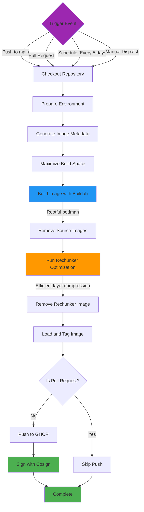
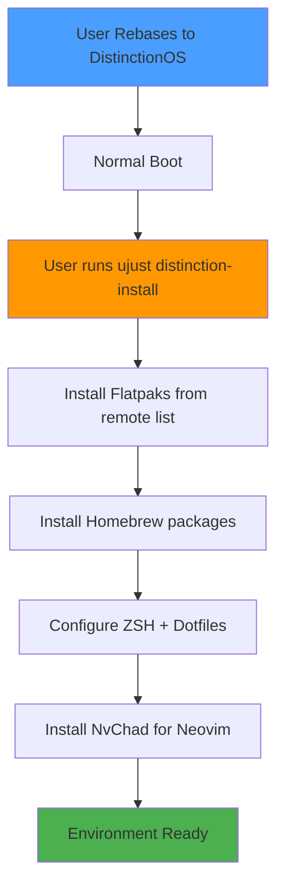

# DistinctionOS Developer Documentation

## Current Status

**Build System**: Fully operational with automated CI/CD via GitHub Actions  
**Base System**: Bazzite (Fedora Atomic Desktop)  
**Last Updated**: 2026-08-08  
**Kernel**: CachyOS (replaces stock Fedora kernel)  

### Active Features
- Automated image builds every 5 days
- Rechunker optimization for efficient updates
- Image signing with Cosign
- CachyOS kernel for optimized performance
- Custom Mesa stack with freeworld codec support
- ZSH system-wide shell configuration
- Just recipe system for user-space tooling
- Steam Linker housekeeper
- XWM Player for Bethesda audio format support

### Build Configuration
- **Image Registry**: `ghcr.io`
- **Default Tag**: `latest`
- **Build Frequency**: Every 5 days (scheduled) + on-demand
- **Build Platform**: Ubuntu 24.04 (GitHub Actions)

---

## Repository Structure

### Directory Layout

```
DistinctionOS/
├── build_files/              # Build-time execution scripts (numerically ordered)
│   ├── 00-kernel.sh             # CachyOS kernel installation
│   ├── 01-kernel-modules.sh     # Initramfs regeneration
│   ├── 02-build.sh              # Package management (RPM, repos, keys)
│   ├── 03-cache-install.sh      # Install pre-cached RPMs from cache OCI artifact
│   ├── 04-force-install.sh      # rpm --force --nodeps install from force-install OCI artifact
│   ├── 05-remote-grabber.sh     # GNOME Shell extension management
│   ├── 06-fix-opt.sh            # /opt persistence configuration
│   ├── 07-config.sh             # System services and misc config
│   ├── 08-validate.sh           # Post-install environment sanity checks
│   └── 95-utility-functions.sh  # Shared logging/utility library (sourced by all)
│
├── system_files/             # Static files overlaid onto the image at build time
│   ├── usr/
│   │   ├── bin/              # Custom executables (xiso, advmv, advcp, etc.)
│   │   ├── lib/systemd/user/ # User SystemD services
│   │   ├── share/distinctionos/  # DistinctionOS project files
│   │   │   ├── just/         # ujust recipe files
│   │   │   ├── lib/          # Housekeeper shared library
│   │   │   └── steam-linker/ # Steam Linker script and config
│   │   ├── share/fonts/      # Bundled Nerd Fonts
│   │   ├── share/icons/      # Cursor themes
│   │   ├── share/themes/     # GTK theme (adw-gtk3-dark)
│   │   ├── share/applications/  # .desktop files
│   │   ├── share/mime/       # MIME type registrations
│   │   └── share/glib-2.0/schemas/  # GNOME schema overrides
│   └── etc/
│       ├── zsh/              # System-wide ZSH configuration
│       ├── sudoers.d/        # Sudo configuration
│       ├── yum.repos.d/      # Pre-installed repository configs
│       ├── profile.d/        # Shell environment scripts
│       ├── rpm-ostreed.conf.d/  # rpm-ostree daemon config (TPM)
│       └── systemd/          # System-level systemd config
│
├── repo_files/               # Package manifest lists (fetched at post-install time)
│   ├── brews                 # Homebrew package list
│   ├── flatpaks              # Flatpak application list
│   └── rpm/                  # RPM resources
│
├── disk_config/              # Bootable disk configuration
│   ├── disk.toml             # QCOW2/RAW configuration
│   └── iso.toml              # ISO installer configuration
│
├── docs/                     # Project documentation
│   ├── developer.md          # This file
│   ├── claude.md             # AI assistant context
│   ├── steam-linker.md       # Steam Linker housekeeper
│   └── ujust-recipes.md      # ujust recipe reference
│
├── .github/workflows/        # CI/CD automation
│   ├── build.yml             # Main image build workflow
│   ├── build-mesa.yml        # Custom Mesa stack build (weekly)
│   └── build-disk.yml        # Bootable disk creation
│
├── Containerfile             # Image build instructions
├── Justfile                  # Local development tooling
├── cosign.pub                # Image signing public key
└── README.md                 # Project overview
```

---

## Build Process Architecture

### Overview

DistinctionOS employs a multi-stage build process that transforms a base Bazzite image into a fully customized, production-ready system. The build occurs in two primary contexts:

1. **Build-Time**: Image layer construction via `Containerfile` and build scripts
2. **Runtime**: Post-rebase user configuration via Just recipes and systemd services

### Build Script Execution Flow

```mermaid
flowchart TD
    Start([Containerfile Execution]) --> Copy[Copy system_files overlay]
    Mesa --> B0[0. kernel.sh]

    B0 --> B0A[Remove stock kernel packages]
    B0A --> B0B[Install CachyOS kernel via COPR]
    B0B --> B1

    B1[1. kernel-modules.sh] --> B1A[Detect installed kernel version]
    B1A --> B1D[Run depmod]
    B1D --> B1B[Regenerate initramfs with dracut]
    B1B --> B2

    B2[2. build.sh] --> B2A[Remove unwanted Bazzite packages]
    B2A --> B2B[Install RPM packages - resilient strategy]
    B2B --> B2C[Validate critical packages]
    B2C --> B3

    B3[3. cache-install.sh] --> B3A[dnf install /var/tmp/cache-rpms/*.rpm]
    B3A --> B4

    B4[4. force-install.sh] --> B4A[rpm --force --nodeps force-install RPMs]
    B4A --> B5

    B5[5. remote-grabber.sh] --> B5A[Download GNOME Shell extensions]
    B5A --> B5B[Compile gschemas]
    B5B --> B6

    B6[6. fix-opt.sh] --> B6A[Scan /var/opt directory]
    B6A --> B6B[Generate tmpfiles.d config]
    B6B --> B6C[Ensure /opt persistence]
    B6C --> B7

    B7[7. config.sh] --> B7A[Configure default shell]
    B7A --> B7B[Setup Just recipes]
    B7B --> B7C[Customize applications]
    B7C --> B7D[Update system caches]
    B7D --> B7E[Remove unwanted files]
    B7E --> B8

    B8[8. validate.sh] --> B8A[ldconfig / icon / pixbuf / schema / font checks]
    B8A --> Finish

    Finish([Image Complete]) --> Push[Push to GHCR]

    style Start fill:#4a9eff
    style Finish fill:#4caf50
    style Push fill:#ff9800
```



### GitHub Actions Workflow Execution



### Post-Rebase Runtime Flow



---

## Script Detailed Reference

---

### 2. `02-build.sh`
**Purpose**: Core package management and repository configuration  
**Execution Stage**: Build-time (third script)  
**Key Functions**:
- Remove unwanted packages from base image
- Install RPM packages using resilient best-effort strategy (bulk first, per-package fallback)
- Track succeeded/failed/skipped packages
- Validates critical package installation

**Resilience Strategy**:
- Repository outages (openzfs, CrossOver, Cider have had incidents) no longer fail the build
- Failed packages are logged but the build continues

**Short packagelist and why each is installed:**
- Crossover: Cause I support wine development by supporting the main developer of wine: codeweavers.
- libheif-freeworld: gnome-image-viewer can't open heic files without this.
- sassc & gtk-murrine-engine: many themes can often require it.
- dcraw: allows for thumbnail generation on image-raw photos from dslr's.


---

### 6. `06-fix-opt.sh`
**Purpose**: Ensure `/opt` directory persistence across reboots  
**Execution Stage**: Build-time (sixth script — runs *after* cache/force install so `/opt` packages from the OCI artifacts, e.g. CrossOver, are present in `/var/opt`)  
**Mechanism**: Creates systemd tmpfiles.d configuration  
**Key Functions**:
- Dynamically scans `/var/opt` directory at build time
- Moves directories to `/usr/lib/opt`
- Generates `/usr/lib/tmpfiles.d/distinction-opt-fix.conf`
- Configuration executed at runtime by systemd-tmpfiles

**Enhanced Features** (2025-10-27 Refactoring):
- Minimal color-coded logging for consistency
- Clean structure (~45 lines total)
- Clear informational notes about persistence mechanism

**Technical Background**:
On immutable systems, `/opt` can be ephemeral. The tmpfiles.d configuration ensures that packages installed to `/opt` (like Brave Browser, CrossOver) remain accessible after reboot by creating symlinks from `/var/opt` to `/usr/lib/opt`.

**Example Generated Config**:
```ini
# Generated by fix-opt.sh
L+ /var/opt/brave-browser - - - - /usr/lib/opt/brave-browser
L+ /var/opt/crossover - - - - /usr/lib/opt/crossover
```

---

**Major Sections**:
1. Shell Configuration
2. SystemD Service Configuration
3. Just Recipe Integration
4. Application Customization
5. System Cache Updates
6. Cleanup (Applications & Bazzite Remnants)


---

## Code Quality & Logging Standards

### Logging System

All build scripts use the centralized logging system from `95-utility-functions.sh`.

#### Logging Functions

```bash
# Source at the top of every build script:
source /ctx/95-utility-functions.sh

# Logging functions provided by utility library:
log_header()    # Blue box-drawing characters for major sections
log_section()   # Cyan arrows (▶) for subsections
log_success()   # Green checkmarks (✓) for successful operations
log_warning()   # Yellow warnings (⚠) for non-critical issues
log_error()     # Red X marks (✗) for errors
log_info()      # Magenta info symbols (ℹ) for informational messages

# Script lifecycle functions:
script_start "Name" "Description"   # Print startup header
script_complete "Name" "Next step"  # Print completion footer
```

#### Color Coding Standards

| Color | Symbol | Purpose | Usage Example |
|-------|--------|---------|---------------|
| **Blue** | ╔═══╗ | Major section headers | Script start/completion |
| **Cyan** | ▶ | Subsection starts | "Installing packages" |
| **Green** | ✓ | Success messages | "Package installed successfully" |
| **Yellow** | ⚠ | Warnings (non-critical) | "Some packages may have failed" |
| **Red** | ✗ | Errors (critical) | "Critical package missing" |
| **Magenta** | ℹ | Informational messages | "Current version locks" |

#### Visual Output Example

```
╔════════════════════════════════════════════════════════════════════╗
║ DistinctionOS Package Installation & Configuration
╚════════════════════════════════════════════════════════════════════╝

▶ Installing packages from configured repositories
ℹ Installing from fedora: yt-dlp zsh neovim...
✓ Installed packages from fedora

▶ Validating critical package installation
✓ All critical packages validated

╔════════════════════════════════════════════════════════════════════╗
║ Package installation phase complete
╚════════════════════════════════════════════════════════════════════╝
```

### Code Quality Guidelines

#### Script Structure

All build scripts should follow this structure:

1. **Header Comment Block**
   ```bash
   # ============================================================================
   # Script Name and Purpose
   # ============================================================================
   # Note: Important caveats or context
   # ============================================================================
   ```

2. **Shebang, Error Handling, and Utility Functions**
   ```bash
   #!/usr/bin/bash
   set -euo pipefail
   source /ctx/95-utility-functions.sh
   ```

3. **Main Script Logic**
   - Major sections with clear headers
   - Subsections with visual separators
   - Comments explaining WHY, not WHAT

4. **Completion Summary**
   ```bash
   script_complete "Script Name" "Next step: ..."
   exit 0
   ```

#### Documentation Standards

**Section Headers**:
```bash
# ============================================================================
# Major Section Name
# ============================================================================
# Purpose explanation
# Context or caveats
```

**Subsection Headers** (for related operations within a section):
```bash
# ──────────────────────────────────────────────────────────────────────────
# Subsection Name
# ──────────────────────────────────────────────────────────────────────────
# Issue: Problem description
# Solution: How we're solving it
```

**Inline Comments**:
- Focus on **WHY**, not WHAT
- Provide context for unusual approaches
- Document workarounds with issue descriptions
- Explain rationale for future maintainers

#### Validation Patterns

```bash
# Package validation
validate_critical_packages() {
  local -a critical_packages=("$@")
  local failed=0
  
  for pkg in "${critical_packages[@]}"; do
    if ! rpm -q "$pkg" &>/dev/null; then
      log_error "Critical package missing: $pkg"
      ((failed++))
    fi
  done
  
  if [[ $failed -gt 0 ]]; then
    return 1
  fi
  return 0
}

# Counters for removal operations
removed_count=0
for item in "${items[@]}"; do
  if [[ -e "$item" ]]; then
    rm -f "$item"
    ((removed_count++))
  fi
done
log_success "Removed $removed_count item(s)"
```


---

## Adding New Packages and Services

### Adding RPM Packages

**Edit**: `build_files/02-build.sh`

`02-build.sh` uses a resilient per-repository installation strategy. Packages are grouped by repository and passed to `install_packages_resilient`:

```bash
# Add to the appropriate repo call
install_packages_resilient "fedora" \
    existing-package \
    new-package-name

# For a COPR repo, enable it first, then pass its name
dnf5 -y copr enable user/reponame
install_packages_resilient "copr:user/reponame" \
    copr-package-name
```

For a completely new external repo with a `.repo` file, add the repo file to `system_files/etc/yum.repos.d/` so it's present when the build script runs — no need to add it dynamically in the script.

**Note**: Build scripts use `dnf5` at build-time. Runtime package management uses `rpm-ostree`.

### Adding Flatpak Applications

**Edit**: `repo_files/flatpaks` (stored in GitHub repository)

```bash
# Add Flatpak identifier to the list
echo "com.example.Application" >> repo_files/flatpaks

# Users will receive this on next distinction-install run
```

**Alternative**: Direct installation via Just recipe
```bash
ujust distinction-install-flatpaks
```

### Adding GNOME Shell Extensions

**Edit**: `build_files/05-remote-grabber.sh`

```bash
# Add extension UUID or URL to download list
# Script handles installation and gschema compilation
```

### Adding System Services

**Method 1**: Enable existing service in `config.sh`
```bash
systemctl enable service-name.service
```

**Method 2**: Add custom systemd unit
1. Create unit file in `system_files/usr/lib/systemd/system/`
2. Enable in `config.sh`:
```bash
systemctl enable custom-service.service
```

### Adding Custom Executables

1. Place executable in `system_files/usr/bin/`
2. Ensure executable permissions in Containerfile:
```dockerfile
RUN chmod +x /usr/bin/custom-script
```

---

## Local Development Workflow

### Building Locally

The root `Justfile` provides comprehensive local development tools:

```bash
# Build the container image locally
just build

# Build and create a bootable QCOW2 VM image
just build-qcow2

# Build and create an ISO installer
just build-iso

# Run the image in a VM for testing
just run-vm-qcow2

# Alternative: Use systemd-vmspawn
just spawn-vm

# Lint all shell scripts
just lint

# Format all shell scripts
just format

# Clean build artifacts
just clean
```

### Testing Changes

1. **Make changes** to build scripts or system files
2. **Build locally**: `just build`
3. **Test in VM**: `just run-vm-qcow2`
4. **Verify functionality** within VM
5. **Commit changes** to feature branch
6. **Create Pull Request** for CI/CD validation

### Debugging Build Failures

```bash
# Check GitHub Actions logs
# Navigate to: Repository → Actions → Failed Workflow

# Build locally with verbose output
podman build --format docker --tag localhost/distinctionos:test .

# Inspect specific build stage
podman build --target <stage-name> --tag test-stage .

# Enter container for debugging
podman run -it localhost/distinctionos:test /bin/bash
```

---

## Known Issues

### Current Issues

1. **NvChad Root Installation**: May require verification after first run
   - **Workaround**: Run `sudo nvim` manually to complete setup

2. **TPM Auto-Unlock**: System is being redesigned — current state is partial (rpm-ostree config file only). Full ujust recipes and monitor service are planned.

### Error Handling Improvements Needed

- Just recipes require better error handling for network failures

---

## Roadmap

### Short-Term Goals

- [ ] Redesign TPM auto-unlock system (ujust recipes + monitor service)
- [ ] Expand housekeeper functionality (`.housekeeper` config files)
- [ ] Update GitHub Actions to generate release pages with package changelogs

### Long-Term Goals

- [ ] **Standalone ISO**: Fully functional installer ISO (in progress via build-disk.yml)
- [ ] **Build Caching**: Implement layer caching for faster iteration

### Completed Goals

- [✅] Rechunker support for efficient updates
- [✅] ZSH system-wide shell configuration
- [✅] Steam Linker housekeeper
- [✅] XWM Player for Bethesda audio format support
- [✅] Build script refactoring — utility library, resilient package installation, color-coded logging
- [✅] Consolidated all build scripts into numbered sequence (00–06)

---

## Additional Notes

### Image Signing

Images are signed with Cosign for verification:
```bash
# Public key location
cosign.pub

# Verification command (for users)
cosign verify --key cosign.pub ghcr.io/username/distinctionos:latest
```

### Rechunker Optimization

Rechunker provides:
- **Efficient layer compression**: Reduces bandwidth for updates
- **Deduplication**: Eliminates redundant data across layers
- **Faster updates**: Users download only changed content
- **Configuration**: `max-layers: 100` for optimal balance

### Post-Rebase Setup

After rebasing to DistinctionOS, run the setup manually:

```bash
ujust distinction-install
```

This installs Flatpaks, Homebrew packages, configures ZSH with dotfiles, and sets up NvChad.

See `docs/ujust-recipes.md` for the full recipe list.

### Security Considerations

**Passwordless Sudo**:
- Configured for `wheel` group
- Location: `/etc/sudoers.d/99-distinction-wheel-nopasswd`
- **Author is aware of security implications**
- Recommended for personal systems only

**TPM Configuration**:
- `etc/rpm-ostreed.conf.d/distinction.tpm.conf` enables TPM hints for rpm-ostree daemon
- Full TPM auto-unlock system is planned but not yet fully implemented

### Contributing Guidelines

When submitting changes:
1. Follow Google Shell Style Guide for bash scripts
2. Use 2-space indentation in YAML files
3. Test locally before pushing to remote
4. Update documentation for user-facing changes
5. Use descriptive commit messages
6. Create feature branches for significant changes

### Useful Resources

- [Universal Blue Documentation](https://universal-blue.org/)
- [Bazzite Documentation](https://docs.bazzite.gg/)
- [rpm-ostree Documentation](https://coreos.github.io/rpm-ostree/)
- [Bootc Image Builder](https://github.com/osbuild/bootc-image-builder)
- [Systemd tmpfiles.d](https://www.freedesktop.org/software/systemd/man/tmpfiles.d.html)

---

**Document Version**: 2.2  
**Last Updated**: 2026-08-08  
**Major Changes**: Re-enabled CachyOS kernel (non-LTO variant), added explicit `depmod` step to `01-kernel-modules.sh` to fix initramfs regeneration failure  
**Maintainer**: phantomcortex
