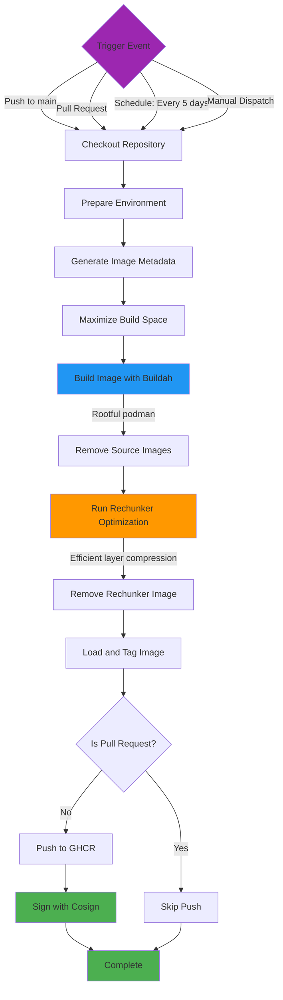
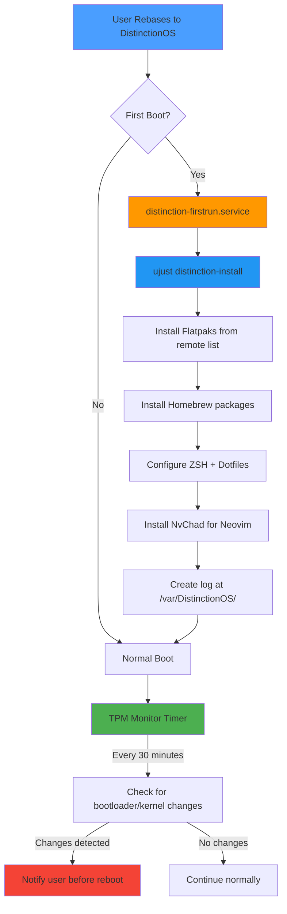

# DistinctionOS Developer Documentation

## Current Status

**Build System**: Fully operational with automated CI/CD via GitHub Actions  
**Base System**: Bazzite (Fedora Atomic Desktop)  
**Last Updated**: 2025-10-27  
**Stability**: Maturing - ZFS module enabled by default  
**Recent Changes**: Complete build script refactoring with enhanced logging and documentation

### Active Features
-  Automated image builds every 5 days
-  Rechunker optimization for efficient updates
-  Image signing with Cosign
-  TPM auto-unlock system with monitoring
-  First-run automation for post-rebase setup
-  ZSH as default shell with automated configuration
-  Just recipe system for user-space tooling

### Build Configuration
- **Image Registry**: `ghcr.io`
- **Default Tag**: `latest`
- **Build Frequency**: Every 5 days (scheduled) + on-demand
- **Build Platform**: Ubuntu 24.04 (GitHub Actions)

---

## Repository Structure

### Directory Layout (Post-Cleanup)

```
DistinctionOS/
├── build-files/              # Build-time execution scripts
│   ├── 01-build.sh              # Package management (RPM, repos, keys)
│   ├── 02-install-zfs.sh        # ZFS kernel module compilation
│   ├── 03-fix-opt.sh            # /opt persistence configuration
│   ├── 04-config.sh             # System services and misc config
│   ├── 05-kernel-modules.sh     # xpadneo kernel module compilation
│   ├── 06-remote-grabber.sh     # GNOME Shell extension management
│   ├── remote-grabber.sh        # (inactive)
│   └── 95-kernel-modules.sh     # logging functions & color codes
│
├── system-files/             # Static files overlaid onto the image
│   ├── usr/
│   │   ├── bin/              # Custom executables
│   │   ├── lib/systemd/      # SystemD units and timers
│   │   └── share/DistinctionOS/just/  # Just recipes
│   └── etc/
│       └── sudoers.d/        # Sudo configuration
│
├── repo-files/               # Package manifest lists
│   ├── brews                 # Homebrew package list
│   └── flatpaks              # Flatpak application list
│
├── disk-config/              # Bootable disk configuration
│   ├── disk.toml             # QCOW2/RAW configuration
│   └── iso.toml              # ISO installer configuration
│
├── docs/                     # Project documentation
│   ├── developer.md          # This file
│   ├── claude.md             # AI assistant context
│   └── (future: wine.md, planning.md, etc.)
│
├── .github/workflows/        # CI/CD automation
│   ├── build.yml             # Main image build workflow
│   └── build-disk.yml        # Bootable disk creation
│
├── Containerfile             # Image build instructions
├── Justfile                  # Local development tooling
├── cosign.pub                # Image signing public key
└── README.md                 # Project overview
```

---

## Build Process Architecture

### Overview

DistinctionOS employs a multi-stage build process that transforms a base Bazzite image into a fully customized, production-ready system. The build occurs in two primary contexts:

1. **Build-Time**: Image layer construction via `Containerfile` and build scripts
2. **Runtime**: Post-rebase user configuration via Just recipes and systemd services

### Build Script Execution Flow

```mermaid
flowchart TD
    Start([Containerfile Execution]) --> Copy[Copy system-files overlay]
    Copy --> B1[1. build.sh]
    
    B1 --> B1A[Add RPM repositories]
    B1A --> B1B[Import GPG keys]
    B1B --> B1C[Install/remove RPM packages]
    B1C --> B1D[Validate critical packages]
    B1D --> B2
    
    B2[2. install-zfs.sh] --> B2A[Install ZFS repository]
    B2A --> B2B[Install ZFS packages]
    B2B --> B3
    
    B3[3. fix-opt.sh] --> B3A[Scan /opt directory]
    B3A --> B3B[Generate tmpfiles.d config]
    B3B --> B3C[Ensure /opt persistence]
    B3C --> B4
    
    B4[4. config.sh] --> B4A[Configure default shell]
    B4A --> B4B[Setup Just recipes]
    B4B --> B4C[Customize applications]
    B4C --> B4D[Update system caches]
    B4D --> B4E[Remove unwanted files]
    B4E --> B5
    
    B5[5. kernel-modules.sh] --> B5A[Detect kernel version]
    B5A --> B5B[Compile xpadneo module]
    B5B --> B5C[Regenerate initramfs]
    B5C --> B6
    
    B6[6. remote-grabber.sh] --> B6A[Download GNOME Shell extensions]
    B6A --> B6B[Compile gschemas]
    B6B --> Finish
    
    Finish([Image Complete]) --> Push[Push to GHCR]
    
    style Start fill:#4a9eff
    style Finish fill:#4caf50
    style Push fill:#ff9800
```



### GitHub Actions Workflow Execution



### Post-Rebase Runtime Flow



---

## Script Detailed Reference

### 1. `01-build.sh`
**Purpose**: Core package management and repository configuration  
**Execution Stage**: Build-time (first script)  
**Key Functions**:
- Add/remove RPM repositories (e.g., Brave, Cider, COPR repos)
- Import GPG/ASC keys for package verification
- Remove unwanted packages from base image
- Validate critical package installation
- Package versionlock section

**Enhanced Features** (2025-10-27 Refactoring):
- Color-coded logging with visual indicators (✓, ✗, ⚠, ℹ, ▶)
- Package validation to catch installation failures
- Comprehensive error handling with clear messages
- Organized package installation by repository
- Theme installation from GitHub releases

---

### 2. `02-install-zfs.sh`
**Purpose**: Install ZFS filesystem driver and prepare for DKMS compilation  
**Execution Stage**: Build-time (second script)  
**Status**: Currently active (intermittently disabled during rapid development to speed up builds)  
**Key Functions**:
- Install ZFS repository
- Install ZFS packages
- Note: DKMS compilation handled by `05-kernel-modules.sh`

**Enhanced Features** (2025-10-27 Refactoring):
- Minimal color-coded logging for consistency
- Clean, concise structure (~35 lines total)
- Clear indication that DKMS happens later

---

### 3. `03-fix-opt.sh`
**Purpose**: Ensure `/opt` directory persistence across reboots  
**Execution Stage**: Build-time (third script)  
**Mechanism**: Creates systemd tmpfiles.d configuration  
**Key Functions**:
- Dynamically scans `/var/opt` directory at build time
- Moves directories to `/usr/lib/opt`
- Generates `/usr/lib/tmpfiles.d/distinction-opt-fix.conf`
- Configuration executed at runtime by systemd-tmpfiles

**Enhanced Features** (2025-10-27 Refactoring):
- Minimal color-coded logging for consistency
- Clean structure (~45 lines total)
- Clear informational notes about persistence mechanism

**Technical Background**:
On immutable systems, `/opt` can be ephemeral. The tmpfiles.d configuration ensures that packages installed to `/opt` (like Brave Browser, CrossOver) remain accessible after reboot by creating symlinks from `/var/opt` to `/usr/lib/opt`.

**Example Generated Config**:
```ini
# Generated by fix-opt.sh
L+ /var/opt/brave-browser - - - - /usr/lib/opt/brave-browser
L+ /var/opt/crossover - - - - /usr/lib/opt/crossover
```

---

### 4. `04-config.sh`
**Purpose**: System service configuration, application customization, and cleanup  
**Execution Stage**: Build-time (fourth script)  
**Key Functions**:
- Configure default shell (ZSH for new users and root)
- Setup SystemD services (currently disabled during testing)
- Integrate Just recipes and hide incompatible Bazzite recipes
- Customize application .desktop files (Cider icon, Winetricks debug suppression)
- Update system caches (icon, desktop, glib schemas, MIME)
- Remove unwanted application shortcuts (Waydroid, Wine utilities)
- Cleanup Bazzite remnants

**Enhanced Features** (2025-10-27 Refactoring):
- Complete reorganization into six major sections
- Comprehensive color-coded logging throughout
- Associative array for Bazzite file removal with documented reasons
- Counters for removal operations with clear summaries
- Extensive inline documentation explaining WHY operations are performed
- Visual subsection separators for related tasks
- Configuration summary at completion

**Major Sections**:
1. Shell Configuration
2. SystemD Service Configuration
3. Just Recipe Integration
4. Application Customization
5. System Cache Updates
6. Cleanup (Applications & Bazzite Remnants)

**Common Tasks**:
```bash
# Enable a service
systemctl enable service-name.service

# Disable a service
systemctl disable unwanted-service.service

# Mask a service (prevent activation)
systemctl mask problematic-service.service

# Add files to cleanup with documented reasons
declare -A CLEANUP_FILES=(
  ["/path/to/file"]="Reason for removal"
)
```

---

### 5. `05-kernel-modules.sh`
**Purpose**: Compile xpadneo kernel module for enhanced Xbox controller support and regenerate initramfs  
**Execution Stage**: Build-time (fifth script)  
**Key Functions**:
- Detect installed Bazzite kernel version
- Clone xpadneo repository from GitHub
- Generate custom makefile for ostree compatibility
- Compile xpadneo kernel module
- Install module to kernel directories
- Verify module installation
- Regenerate initramfs with new modules (includes ZFS if installed)

**Enhanced Features** (2025-10-27 Refactoring):
- Complete color-coded logging system
- Kernel detection validation
- Repository clone verification
- Installation verification with specific file location reporting
- Initramfs regeneration with validation
- Summary of installed modules at completion

**Technical Notes**:
- Custom makefile required for ostree/immutable systems
- Makefile heredoc preserved exactly as needed for compatibility
- Handles both xpadneo and ZFS DKMS compilation
- Sets secure permissions (0600) on initramfs

**Future TODOs**:
- Integrate CachyOS-LTO kernel as default
- Investigate kmod package installation after initramfs regeneration
- Consider packaged xpadneo variant if available
- Fix SecureBoot

---

### 6. 06-remote-grabber.sh
**Purpose**: Manage GNOME Shell extensions in the system image   
**Key Functions**:
- Download specified GNOME Shell extensions
- Compile gschemas for extensions
- Enable extensions system-wide

**Advantages**:
- Extensions available immediately after installation
- No manual installation required
- Version control for extension consistency

---

## Code Quality & Logging Standards

### Logging System (Established 2025-10-27)

All build scripts now follow a standardized color-coded logging system for consistent, readable output during builds.

#### Logging Functions

```bash
# ANSI color codes (defined in each script)
readonly COLOR_RESET='\033[0m'
readonly COLOR_RED='\033[31m'
readonly COLOR_GREEN='\033[32m'
readonly COLOR_YELLOW='\033[33m'
readonly COLOR_BLUE='\033[34m'
readonly COLOR_MAGENTA='\033[35m'
readonly COLOR_CYAN='\033[36m'

# Logging function templates
log_header()   # Blue box-drawing characters for major sections
log_section()  # Cyan arrows (▶) for subsections
log_success()  # Green checkmarks (✓) for successful operations
log_warning()  # Yellow warnings (⚠) for non-critical issues
log_error()    # Red X marks (✗) for errors
log_info()     # Magenta info symbols (ℹ) for informational messages
```

#### Color Coding Standards

| Color | Symbol | Purpose | Usage Example |
|-------|--------|---------|---------------|
| **Blue** | ╔═══╗ | Major section headers | Script start/completion |
| **Cyan** | ▶ | Subsection starts | "Installing packages" |
| **Green** | ✓ | Success messages | "Package installed successfully" |
| **Yellow** | ⚠ | Warnings (non-critical) | "Some packages may have failed" |
| **Red** | ✗ | Errors (critical) | "Critical package missing" |
| **Magenta** | ℹ | Informational messages | "Current version locks" |

#### Visual Output Example

```
╔════════════════════════════════════════════════════════════════════╗
║ DistinctionOS Package Installation & Configuration
╚════════════════════════════════════════════════════════════════════╝

▶ Installing packages from configured repositories
ℹ Installing from fedora: yt-dlp zsh neovim...
✓ Installed packages from fedora

▶ Validating critical package installation
✓ All critical packages validated

╔════════════════════════════════════════════════════════════════════╗
║ Package installation phase complete
╚════════════════════════════════════════════════════════════════════╝
```

### Code Quality Guidelines

#### Script Structure

All build scripts should follow this structure:

1. **Header Comment Block**
   ```bash
   # ============================================================================
   # Script Name and Purpose
   # ============================================================================
   # Note: Important caveats or context
   # ============================================================================
   ```

2. **Shebang and Error Handling**
   ```bash
   #!/usr/bin/bash
   set -euo pipefail
   ```

3. **Logging Function Definitions**
   ```bash
   # Color codes and logging functions
   ```

4. **Main Script Logic**
   - Major sections with clear headers
   - Subsections with visual separators
   - Comprehensive comments explaining WHY

5. **Completion Summary**
   ```bash
   log_header "Script phase complete"
   log_info "Next steps: ..."
   exit 0
   ```

#### Documentation Standards

**Section Headers**:
```bash
# ============================================================================
# Major Section Name
# ============================================================================
# Purpose explanation
# Context or caveats
```

**Subsection Headers** (for related operations within a section):
```bash
# ──────────────────────────────────────────────────────────────────────────
# Subsection Name
# ──────────────────────────────────────────────────────────────────────────
# Issue: Problem description
# Solution: How we're solving it
```

**Inline Comments**:
- Focus on **WHY**, not WHAT
- Provide context for unusual approaches
- Document workarounds with issue descriptions
- Explain rationale for future maintainers

#### Error Handling Patterns

```bash
# File existence checks
if [[ -f "$file_path" ]]; then
  log_info "Processing file"
  # ... operation
  log_success "File processed"
else
  log_warning "File not found, skipping"
fi

# Command success validation
if command_here; then
  log_success "Operation successful"
else
  log_error "Operation failed"
  exit 1  # Exit on critical failures only
fi

# Non-critical operations
if optional_command || true; then
  log_success "Optional operation completed"
else
  log_warning "Optional operation failed (non-critical)"
fi
```

#### Variable Conventions

```bash
# Constants (readonly, UPPERCASE)
readonly COLOR_RESET='\033[0m'
readonly KERNEL_VERSION="5.14.0"

# Arrays (readonly where appropriate)
readonly -a REMOVE_PACKAGES=(...)
declare -A PACKAGE_REPOS=(...)

# Local variables (lowercase with underscores)
local package_count=0
local file_path="/path/to/file"
```

#### Validation Patterns

```bash
# Package validation
validate_critical_packages() {
  local -a critical_packages=("$@")
  local failed=0
  
  for pkg in "${critical_packages[@]}"; do
    if ! rpm -q "$pkg" &>/dev/null; then
      log_error "Critical package missing: $pkg"
      ((failed++))
    fi
  done
  
  if [[ $failed -gt 0 ]]; then
    return 1
  fi
  return 0
}

# Counters for removal operations
removed_count=0
for item in "${items[@]}"; do
  if [[ -e "$item" ]]; then
    rm -f "$item"
    ((removed_count++))
  fi
done
log_success "Removed $removed_count item(s)"
```

### Script Length Guidelines

- **Minimal scripts** (install-zfs.sh, fix-opt.sh): ~35-50 lines
  - Brief logging, essential operations only
  - Clear section headers, minimal validation
  
- **Standard scripts** (kernel-modules.sh): ~200-250 lines
  - Full logging system, comprehensive error handling
  - Detailed documentation, validation at key points
  
- **Complex scripts** (build.sh, config.sh): ~300-400 lines
  - Extensive documentation and inline comments
  - Multiple major sections with subsections
  - Comprehensive validation and error handling

**Note**: Length is acceptable when driven by documentation and error handling, not code duplication.

---

## Adding New Packages and Services

### Adding RPM Packages

**Edit**: `build-files/build.sh`

**Method 1: Add to RPM_PACKAGES associative array**
```bash
# Add packages to the appropriate repository section
declare -A RPM_PACKAGES=(
  ["fedora"]="existing-packages new-package-name"
  ["rpmfusion-free,rpmfusion-free-updates"]="rpmfusion-package"
  ["copr:username/repo"]="copr-package"
)
```

**Method 2: Add custom repository**
```bash
# Add repository configuration before RPM_PACKAGES declaration
log_info "Adding custom repository"
tee /etc/yum.repos.d/custom.repo > /dev/null << 'EOF'
[custom]
name=Custom Repository
baseurl=https://repo.example.com/
enabled=1
gpgcheck=1
gpgkey=https://repo.example.com/key.asc
EOF

# Import GPG key
rpm --import https://repo.example.com/key.asc

# Add to RPM_PACKAGES
declare -A RPM_PACKAGES=(
  ...
  ["custom"]="package-from-custom-repo"
)
```

**Method 3: Direct installation (for special cases)**
```bash
# After the main RPM_PACKAGES loop
log_section "Installing special packages"
if dnf5 -y install special-package; then
  log_success "Special package installed"
else
  log_warning "Special package installation failed"
fi
```

**Note**: Build scripts use `dnf5` at build-time. Runtime package management uses `rpm-ostree`.

### Adding Flatpak Applications

**Edit**: `repo-files/flatpaks` (stored in GitHub repository)

```bash
# Add Flatpak identifier to the list
echo "com.example.Application" >> repo-files/flatpaks

# Users will receive this on next distinction-install run
```

**Alternative**: Direct installation via Just recipe
```bash
ujust distinction-install-flatpaks
```

### Adding Homebrew Packages

**Edit**: `repo-files/brews` (stored in GitHub repository)

```bash
# Add package name to the list
echo "package-name" >> repo-files/brews

# Users will receive this on next distinction-install run
```

### Adding GNOME Shell Extensions

**Edit**: `build-files/remote-grabber.sh`

```bash
# Add extension UUID or URL to download list
# Script handles installation and gschema compilation
```

### Adding System Services

**Method 1**: Enable existing service in `config.sh`
```bash
systemctl enable service-name.service
```

**Method 2**: Add custom systemd unit
1. Create unit file in `system-files/usr/lib/systemd/system/`
2. Enable in `config.sh`:
```bash
systemctl enable custom-service.service
```

### Adding Custom Executables

1. Place executable in `system-files/usr/bin/`
2. Ensure executable permissions in Containerfile:
```dockerfile
RUN chmod +x /usr/bin/custom-script
```

---

## Local Development Workflow

### Building Locally

The root `Justfile` provides comprehensive local development tools:

```bash
# Build the container image locally
just build

# Build and create a bootable QCOW2 VM image
just build-qcow2

# Build and create an ISO installer
just build-iso

# Run the image in a VM for testing
just run-vm-qcow2

# Alternative: Use systemd-vmspawn
just spawn-vm

# Lint all shell scripts
just lint

# Format all shell scripts
just format

# Clean build artifacts
just clean
```

### Testing Changes

1. **Make changes** to build scripts or system files
2. **Build locally**: `just build`
3. **Test in VM**: `just run-vm-qcow2`
4. **Verify functionality** within VM
5. **Commit changes** to feature branch
6. **Create Pull Request** for CI/CD validation

### Debugging Build Failures

```bash
# Check GitHub Actions logs
# Navigate to: Repository → Actions → Failed Workflow

# Build locally with verbose output
podman build --format docker --tag localhost/distinctionos:test .

# Inspect specific build stage
podman build --target <stage-name> --tag test-stage .

# Enter container for debugging
podman run -it localhost/distinctionos:test /bin/bash
```

---

## Known Issues

### Current Issues

1. **NvChad Root Installation**: May require verification after first run
   - **Workaround**: Run `sudo nvim` manually to complete setup


### Error Handling Improvements Needed

- Just recipes require better error handling for network failures
- Improved logging for post-rebase first-run automation

**Completed (2025-10-27)**:
- ✅ Build scripts now validate package installation
- ✅ Comprehensive color-coded logging implemented across all build scripts
- ✅ Error handling patterns standardized
- ✅ Critical package validation added to build.sh

---

## Roadmap

### Short-Term Goals (1-3 months)

- [ ] Apply refactoring patterns to remaining shell scripts in system-files/

### Long-Term Goals (Help Wanted)

- [ ] **Standalone ISO**: Fully functional installer ISO (in progress via build-disk.yml)
- [ ] **CachyOS-LTO Kernel**: Ship optimized kernel by default
- [ ] **Build Caching**: Implement layer caching for faster iteration
- [ ] **Build Time Optimization** Build time optimization strategies

### Completed Goals

- [✅] Rechunker support for efficient updates
- [✅] ZSH as default shell with automated configuration
- [✅] Oh-my-zsh and Powerlevel10k automatic installation
- [✅] TPM auto-unlock with proactive monitoring system
- [✅] **Build Script Refactoring** (2025-10-27):
  - Complete overhaul of build.sh with enhanced logging and validation
  - Refactored install-zfs.sh for clarity
  - Refactored fix-opt.sh with minimal logging
  - Complete reorganization of config.sh into six major sections
  - Refactored kernel-modules.sh with comprehensive error handling
  - Established standardized color-coded logging system
  - Implemented code quality guidelines and documentation standards
- [✅] Consolidated `layered-appimages.sh` functionality (removed separate script)

---

## Additional Notes

### Image Signing

Images are signed with Cosign for verification:
```bash
# Public key location
cosign.pub

# Verification command (for users)
cosign verify --key cosign.pub ghcr.io/username/distinctionos:latest
```

### Rechunker Optimization

Rechunker provides:
- **Efficient layer compression**: Reduces bandwidth for updates
- **Deduplication**: Eliminates redundant data across layers
- **Faster updates**: Users download only changed content
- **Configuration**: `max-layers: 100` for optimal balance

### First-Run Automation

The `distinction-firstrun.service` ensures a seamless post-rebase experience:
- Triggers automatically on first boot after rebase
- Runs `ujust distinction-install` to configure user environment
- Creates log at `/var/DistinctionOS/DistinctionOS_firstrun.log`
- Only executes once (checks for log file existence)
- User can manually re-run with `ujust distinction-install`

### Security Considerations

**Passwordless Sudo**:
- Configured for `wheel` group
- Location: `/etc/sudoers.d/99-distinction-wheel-nopasswd`
- **Author is aware of security implications**
- Recommended for personal systems only

**TPM Security Levels**:
- **Maximum Security**: PCR 0,1,4,5,7,8,9 (most sensitive to changes)
- **Balanced**: PCR 0,4,7,9 (recommended default)
- **Convenience**: PCR 7 only (least restrictive)

### Contributing Guidelines

When submitting changes:
1. Follow Google Shell Style Guide for bash scripts
2. Use 2-space indentation in YAML files
3. Test locally before pushing to remote
4. Update documentation for user-facing changes
5. Use descriptive commit messages
6. Create feature branches for significant changes

### Useful Resources

- [Universal Blue Documentation](https://universal-blue.org/)
- [Bazzite Documentation](https://docs.bazzite.gg/)
- [rpm-ostree Documentation](https://coreos.github.io/rpm-ostree/)
- [Bootc Image Builder](https://github.com/osbuild/bootc-image-builder)
- [Systemd tmpfiles.d](https://www.freedesktop.org/software/systemd/man/tmpfiles.d.html)

---

**Document Version**: 2.0  
**Last Updated**: 2025-10-27  
**Major Changes**: Complete build script refactoring with standardized logging, enhanced error handling, and comprehensive documentation  
**Maintainer**: phantomcortex
